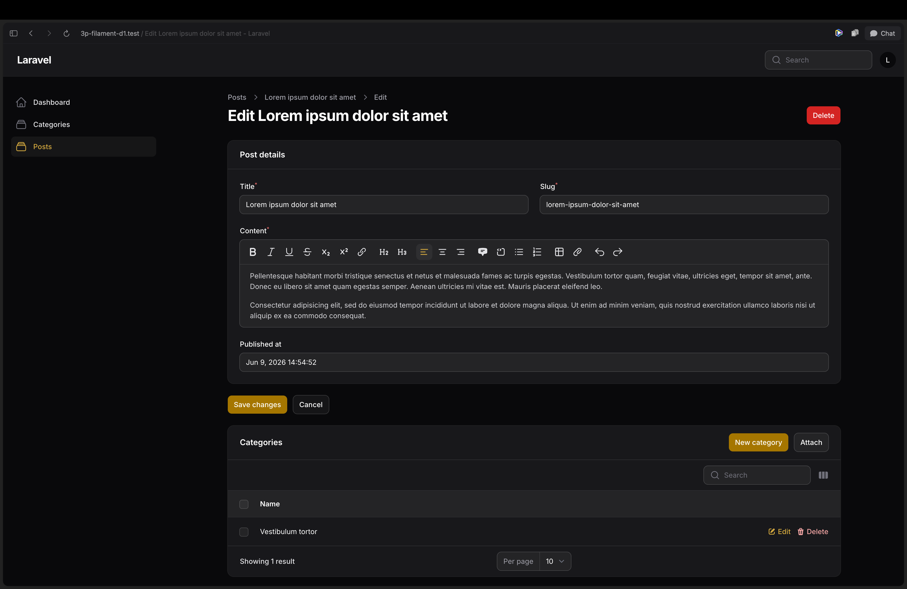

# Desafio Filament 5

Um projeto Laravel do zero dividido em dois desafios para aprender [Filament PHP](https://filamentphp.com).

No dia 28/05, fizemos uma live na [3 Pontos](https://3pontos.com) sobre o Filament 5, onde criamos do zero um painel administrativo para gerenciamento de projetos e tarefas. 
Agradecimento especial ao time da [3 Pontos](https://3pontos.com/) pela oportunidade de compartilhar mais sobre o Filament com a comunidade.

> Se você perdeu a live, acesse o vídeo completo: https://www.twitch.tv/videos/2783202626



Ao final, estabelecemos dois desafios para quem quiser praticar o que foi visto:

- [Desafio 1: Instalação e configuração básica](#desafio-1-instalação-e-configuração-básica)
- [Desafio 2: CMS básico com Blueprint](#desafio-2-cms-básico-com-blueprint)

---

## Pré-requisitos

- PHP 8.3+
- Composer
- Node.js + NPM

---

## Como rodar

Clone o repositório e instale as dependências:

```bash
git clone https://github.com/leandrocfe/3p-filament-d1
cd 3p-filament-d1
cp .env.example .env
composer install
php artisan key:generate
php artisan migrate
npm install && npm run build
```

Escolha como subir o servidor:

### Opção 1: Laravel Herd

Documentação: https://herd.laravel.com

1. Abra o Laravel Herd e adicione o diretório do projeto como site
2. Acesse `http://3p-filament-d1.test`

### Opção 2: Laravel Sail (Docker)

```bash
composer require laravel/sail --dev
php artisan sail:install
./vendor/bin/sail up -d
./vendor/bin/sail artisan migrate
```

Acesse `http://localhost`.

> Ao instalar o Sail, selecione `mysql` quando perguntado. Ajuste o `.env` com as credenciais geradas.

### Opção 3: PHP built-in server

```bash
php artisan serve
```

Acesse `http://localhost:8000`.

---

## Sobre as dicas

> **Tente primeiro.** As dicas mostram a resolução dos problemas. Elas têm mais valor depois que você tentou por conta própria. Antes de abrir qualquer `<details>`, consulte a documentação linkada em cada tarefa. O aprendizado acontece no processo de busca, não na resposta pronta.

---

## Desafio 1: Instalação e configuração básica

### Tarefa 1: Instalar o Filament 5 e criar o painel

Instale o Filament e crie seu primeiro painel administrativo. Quando solicitado pelo comando de instalação, use **`admin`** como ID do painel.

📖 [Documentação de instalação](https://filamentphp.com/docs/5.x/introduction/installation)

<details>
<summary>Dica</summary>

```bash
composer require filament/filament:"^5.0"
php artisan filament:install --panels
```

O painel será criado em `app/Providers/Filament/AdminPanelProvider.php` e acessível em `/admin`.

</details>

---

### Tarefa 2: Criar o primeiro usuário

Crie um usuário para acessar o painel.

> O Filament oferece um comando artisan para isso.

<details>
<summary>Dica</summary>

```bash
php artisan filament:user
```

Siga as instruções interativas para definir nome, e-mail e senha.

</details>

---

### Tarefa 3: Habilitar páginas de autenticação

Por padrão, o painel só tem login. Habilite via panel provider as seguintes páginas:

- **Registro de conta** (`/admin/register`)
- **Recuperação de senha** (`admin/password-reset/request`)
- **Edição de perfil** (`/admin/profile`)

📖 [Documentação de autenticação](https://filamentphp.com/docs/5.x/users/overview#authentication-features)

<details>
<summary>Dica</summary>

No arquivo `app/Providers/Filament/AdminPanelProvider.php`, dentro do método `panel()`, adicione:

```php
->registration()
->passwordReset()
->profile()
```

</details>

---

### Tarefa 4: Alterar a cor do painel

A cor padrão do painel é **Amber**. Troque para a cor que você preferir.

📖 [Documentação do painel](https://filamentphp.com/docs/5.x/panel-configuration#introduction)

📖 [Documentação de cores](https://filamentphp.com/docs/5.x/styling/colors)

<details>
<summary>Dica</summary>

No `AdminPanelProvider.php`, use cores pré-definidas do Filament:

```php
use Filament\Support\Colors\Color;

->colors([
    'primary' => Color::Indigo, // Rose, Violet, Sky, Teal...
])
```

Ou use qualquer cor em hex:

```php
->colors([
    'primary' => Color::hex('#e11d48'),
])
```

</details>

---

### Checklist: Desafio 1

- [ ] Projeto rodando localmente e acessível no navegador
- [ ] Filament 5 instalado (`composer show filament/filament` exibe a versão)
- [ ] Painel acessível em `/admin`
- [ ] Login funciona com o usuário criado via `php artisan filament:user`
- [ ] `/admin/register` acessível e formulário de registro funcionando
- [ ] `/admin/password-reset` acessível e formulário de recuperação funcionando
- [ ] `/admin/profile` acessível após login e permite editar dados
- [ ] Cor primary do painel é diferente de Amber

---

## Desafio 2: CMS básico com Blueprint

Neste desafio você vai usar o [Laravel Blueprint](https://blueprint.laravelshift.com) para gerar o scaffold de um CMS básico com `Post` e `Category`, e depois criar os Resources do Filament manualmente.

### Tarefa 1: Instalar o Laravel Blueprint

📖 [Documentação do Blueprint](https://blueprint.laravelshift.com/docs/getting-started/)

<details>
<summary>Dica</summary>

```bash
composer require --dev laravel-shift/blueprint
```

</details>

---

### Tarefa 2: Completar o `draft.yaml`

O arquivo `draft.yaml` já existe na raiz do projeto com a estrutura inicial. Você precisa completá-lo.

Abra o `draft.yaml` e adicione os campos que estão faltando no model `Post`:

| Campo | Tipo | Observação |
|---|---|---|
| `slug` | string | único |
| `content` | longText | |
| `published_at` | timestamp | nullable |

Adicione também o relacionamento `belongsToMany` entre `Post` e `Category`.

📖 [Sintaxe de models no Blueprint](https://blueprint.laravelshift.com/docs/defining-models/)

📖 [Sintaxe de relacionamentos no Blueprint](https://blueprint.laravelshift.com/docs/model-relationships/)

<details>
<summary>Dica: campos</summary>

No Blueprint, campos seguem o padrão `nome: tipo modificadores`:

```yaml
slug: string unique
content: longText
published_at: timestamp nullable
```

</details>

<details>
<summary>Dica: relacionamento</summary>

```yaml
models:
  Post:
    # ... campos
    relationships:
      belongsToMany: Category
```

</details>

---

### Tarefa 3: Gerar o scaffold

Com o `draft.yaml` completo, gere os models, migrations e factories:

```bash
php artisan blueprint:build
php artisan migrate
```

Verifique os arquivos gerados em `app/Models/`, `database/migrations/` e `database/factories/`.

---

### Tarefa 4: Criar os Filament Resources

📖 [Documentação de Resources](https://filamentphp.com/docs/5.x/resources/overview)

Crie os Resources para `Post` e `Category` manualmente:

```bash
php artisan make:filament-resource Post --generate
php artisan make:filament-resource Category --generate --simple
```

Customize o `form()` e a `table()` de cada Resource para refletir os campos do model.

📖 [Documentação de Resources](https://filamentphp.com/docs/5.x/resources/overview)

📖 [Documentação de Colunas das tabelas](https://filamentphp.com/docs/5.x/tables/columns/overview)

📖 [Documentação de Campos dos formulários](https://filamentphp.com/docs/5.x/forms/overview)

📖 [Gerando uma slug a partir de um título](https://filamentphp.com/docs/5.x/forms/overview#generating-a-slug-from-a-title)

<details>
<summary>Dica: explorando campos do form</summary>

Você pode usar um DateTimePicker, RichEditor, TextInput ou qualquer outro campo que preferir:

```php
use Filament\Forms\Components\DateTimePicker;
use Filament\Forms\Components\RichEditor;
use Filament\Forms\Components\TextInput;
use Filament\Schemas\Components\Section;
use Filament\Schemas\Components\Utilities\Set;
use Filament\Schemas\Schema;
use Illuminate\Support\Str;

class PostForm
{
    public static function configure(Schema $schema): Schema
    {
        return $schema
            ->columns(null)
            ->components([
                Section::make('Post details')
                    ->columns()
                    ->schema([
                        TextInput::make('title')
                            ->required()
                            ->live(onBlur: true)
                            ->afterStateUpdated(fn (Set $set, ?string $state) => $set('slug', Str::slug($state))),
                        TextInput::make('slug')
                            ->required(),
                        RichEditor::make('content')
                            ->required()
                            ->columnSpanFull(),
                        DateTimePicker::make('published_at')
                            ->native(false)
                            ->default(now())
                            ->columnSpanFull(),
                    ]),
            ]);
    }
}
```

> A slug pode ser gerada automaticamente a partir do título usando o método `afterStateUpdated`.

</details>

---

### Tarefa 5: Criar o Relation Manager

No `PostResource`, adicione um Relation Manager para gerenciar as categorias de um post.

📖 [Documentação de Relation Managers](https://filamentphp.com/docs/5.x/resources/managing-relationships#creating-a-relation-manager)

📖 [Attach / Detach](https://filamentphp.com/docs/5.x/resources/managing-relationships#attaching-and-detaching-records)

<details>
<summary>Dica</summary>

```bash
php artisan make:filament-relation-manager PostResource categories name --attach
```

Registre o Relation Manager no `PostResource`:

```php
public static function getRelations(): array
{
    return [
        CategoriesRelationManager::class,
    ];
}
```

</details>

---

### Checklist: Desafio 2

- [ ] Blueprint instalado (`composer show laravel-shift/blueprint` exibe a versão)
- [ ] `draft.yaml` completo com todos os campos de `Post` e o relacionamento `belongsToMany`
- [ ] Migrations geradas e executadas sem erros
- [ ] Models `Post` e `Category` existem com o relacionamento correto
- [ ] `PostResource` e `CategoryResource` acessíveis no painel `/admin`
- [ ] Form e table de cada Resource exibem os campos corretamente
- [ ] Relation Manager de categorias visível na página de edição de um Post
- [ ] É possível associar e desassociar categorias de um post pelo painel

---

## Sobre o autor


**Leandro Ferreira** é especialista em Filament PHP e membro do core team do projeto. Atua com desenvolvimento, palestras e mentorias voltadas ao ecossistema Laravel.

🌐 [leandroferreira.dev.br](https://leandroferreira.dev.br)

📧 Contato para dúvidas, propostas: [leandrocfe@gmail.com](mailto:leandrocfe@gmail.com)

### Curso de Filament

Quer se aprofundar no Filament PHP? Acesse o curso e aprenda na prática a construir painéis administrativos modernos com Laravel.

👉 [Inscreva-se no curso](https://filament.dev.br/#course)

### Canal Filament Brasil

Dicas, tutoriais e novidades sobre Filament e o ecossistema Laravel.

▶️ [youtube.com/@filamentbr](https://youtube.com/@filamentbr)

### Comunidades

Participe das comunidades para tirar dúvidas, compartilhar projetos e acompanhar as novidades:

| Plataforma | Link |
|---|---|
| 💬 WhatsApp | [Entrar no grupo](https://chat.whatsapp.com/HtA1AsQCLDvD08eiKXvRNp) |
| 🎮 Discord | [Entrar no servidor](https://discord.gg/2HtwyjEEZs) |
